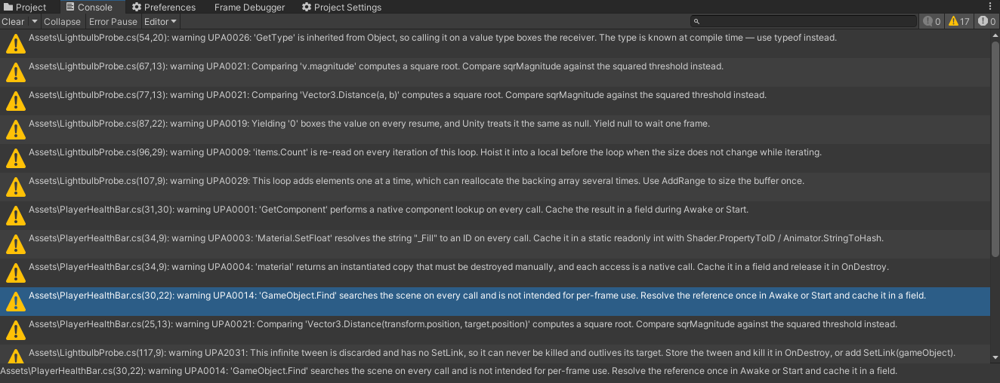
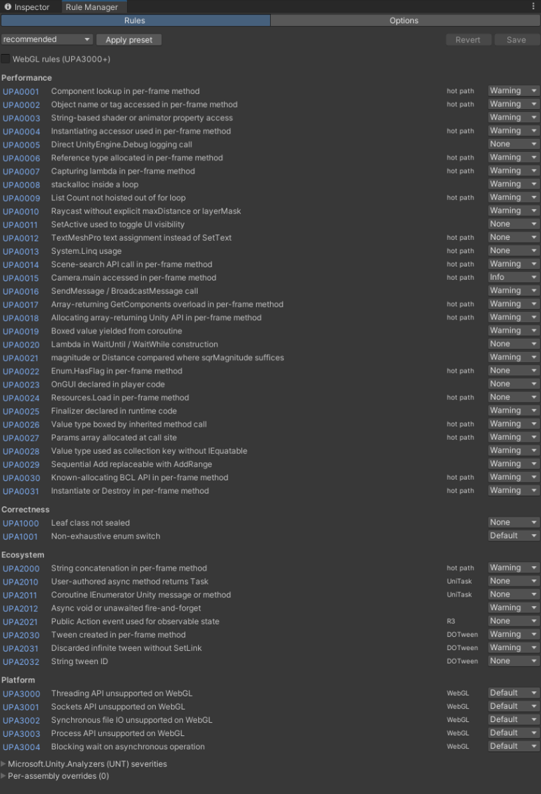
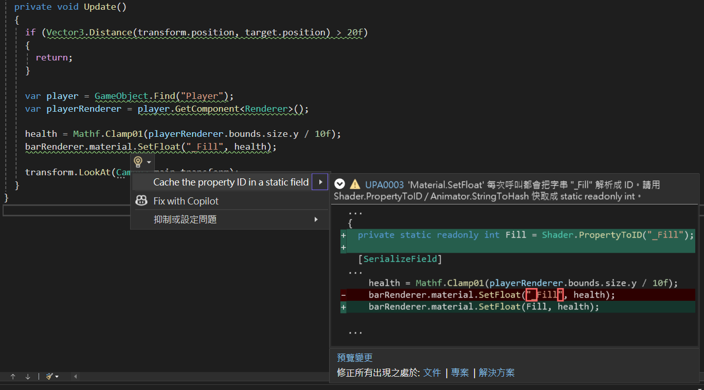
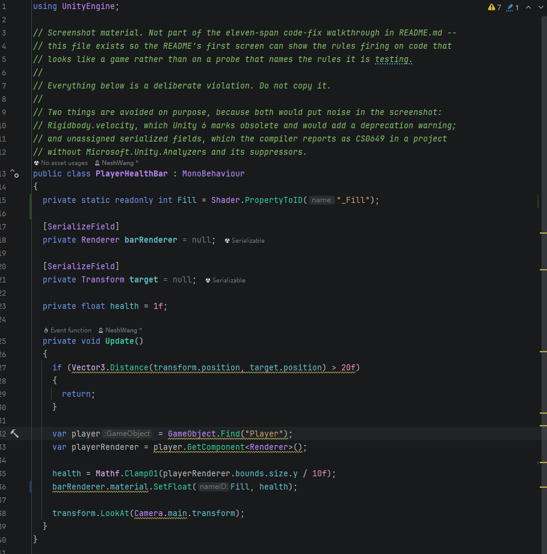

# unity-performance-analyzers

> English | [繁體中文](README.zh-TW.md)

<!-- badges -->
[](https://github.com/NeshGames/unity-performance-analyzers/releases/latest)
[](https://github.com/NeshGames/unity-performance-analyzers/actions/workflows/pr.yml)

[](LICENSE.md)
<!-- /badges -->

Roslyn analyzers that turn Unity performance and correctness conventions into
compile-time checks. Rules adapt automatically to the packages each assembly references
(UniTask, ZString, R3, DOTween) and to whether the project targets WebGL.

Distributed as a UPM package. Supports **Unity 2022.3 LTS through Unity 6**.



The rules run inside Unity's own compile, so they report in the Console, in your IDE as
you type, and in CI through `upa-cli` with no Editor and no licence. A ruleset decides
which of them can fail a build.

> **Status: pre-1.0.** All <!-- generated:rule-count -->46<!-- /generated:rule-count --> rules are implemented and verified against
> Unity 2022.3 and Unity 6 sandbox builds. Two of them — UPA0022 and UPA1000 — are
> deprecated and report nothing unless a project asks them to; their pages say why.
> Rule IDs are stable — once released, an ID is never reused.

## Install

Package Manager > *Add package from git URL…*:

```
https://github.com/NeshGames/unity-performance-analyzers.git?path=/package#v0.8.2
```

The analyzer applies to **every assembly in the project** automatically — no asmdef
references needed (the package deliberately contains no asmdef; adding one would narrow
the analyzer's scope to referencing assemblies only).

Then pick a severity preset (below). Without one, only the rules that are enabled by
default report, at Warning.

## Severity presets

Import the **Ruleset Presets** sample from the Package Manager window, then copy one
preset to `Assets/Default.ruleset`:

| Preset | Intent |
|---|---|
| `minimal` | Unity correctness rules (`UNT` group) as errors; UPA1001 stays at its default warning — a safe first install |
| `recommended` | + UPA performance rules as warnings. The everyday default |
| `strict` | Performance rules become errors; opinionated rules start reporting |
| `cysharp-stack` | + ecosystem rules as errors (UniTask/ZString/R3 adoption) |

Extras in the same sample:

- `webgl-addon.ruleset` — stacks UPA3000–3004 onto any preset via ruleset `<Include>`;
  requires the `UPA_TARGET_WEBGL` scripting define (see the sample README)
- `editor-relaxed.ruleset` — drop into Editor asmdef folders as `Default.ruleset` to
  silence performance rules in tooling code
- `rider-coexist`, `vs-coexist`, `unitask-coexist` — defer the rules another tool in your
  project already reports. Each **includes** its base preset (copy both into `Assets/` and
  rename the coexist file `Default.ruleset`), because a ruleset entry in the including file
  wins — a file written the other way round silences nothing while looking correct. The
  `.editorconfig` of the same name defers them in the IDE only, which is usually what you
  want: see [rule overlap with other tools](docs/overlap.md)
- `.editorconfig` variants of each preset for Rider / Visual Studio parity

Unity reads rulesets only — it does not pass `.editorconfig` to the compiler (verified
on 2022.3 and Unity 6). A `Default.ruleset` inside an asmdef folder overrides the
project-wide one for that assembly.

Import the **Smoke Test** sample to verify the analyzer is loaded: it violates several
rules on purpose and should light up the Console immediately.

## Rule Manager window

**Tools ▸ Unity Performance Analyzers ▸ Rule Manager** manages all of the above without
hand-editing XML:



- **Rules tab** — a severity dropdown for every UPA rule (grouped by category, with
  condition badges) plus a Microsoft.Unity.Analyzers foldout; one-click preset apply
  (read straight from the package, no sample import needed); and a WebGL toggle that
  maintains the `UPA_TARGET_WEBGL` define across **all** build targets together with the
  `webgl-addon.ruleset` Include. Per-asmdef ruleset overrides are listed read-only.
- **Options tab** — edits the universal options file (next section), with an optional
  mirror into `.editorconfig`.

The window edits `Assets/Default.ruleset` conservatively: entries belonging to other
analyzers, `<Include>` lines and comments are preserved as-is.

## Analyzer options (universal options file)

`Assets/Rules.UnityPerformanceAnalyzers.additionalfile` carries every analyzer option in
`key = value` form and is honored by **Unity builds and IDE analysis alike** — Unity
passes additional files to the compiler, which it never does for `.editorconfig`.
Resolution is per key: the options file wins over `.editorconfig`, which wins over the
built-in defaults.

```ini
upa_hot_path_messages = Update,FixedUpdate,LateUpdate,OnTriggerEnter
upa_hot_path_attributes = HotPath,PerformanceCritical
upa_hot_path_include_lambdas = true
upa_enum_switch_allow_default = true
```

| Key | Type | Default | Effect |
|---|---|---|---|
| `upa_hot_path_messages` | comma-separated list | `Update`, `FixedUpdate`, `LateUpdate`, `OnGUI`, `OnAnimatorMove`, `OnAnimatorIK`, `OnPreCull`, `OnPreRender`, `OnPostRender`, `OnRenderObject`, `OnWillRenderObject`, `OnRenderImage`, `OnTriggerStay`, `OnTriggerStay2D`, `OnCollisionStay`, `OnCollisionStay2D`, `OnParticleUpdateJobScheduled` | Which Unity messages on MonoBehaviour types count as per-frame. **Replaces** the default set — list every message you want, including the standard ones. Governs all hot-path rules |
| `upa_hot_path_attributes` | comma-separated list | `HotPath`, `PerformanceCritical` | Attribute short names that mark any method as a hot path, matched by name with the `Attribute` suffix optional. Lets non-message methods opt in |
| `upa_hot_path_include_lambdas` | `true` / `false` | `true` | Whether lambdas and local functions declared inside a hot-path method count as hot. Set `false` if you invoke them elsewhere |
| `upa_enum_switch_allow_default` | `true` / `false` | `true` | For UPA1001, whether a `default` branch (or discard arm) counts as covering the remaining members |

Parsing is tolerant by design: `#` comments, unknown keys and malformed lines are
ignored, an invalid value falls through to the next channel, and a duplicated key keeps
its last value. The Rule Manager's Options tab edits this file for you.

## Rules

Coming from [UnityEngineAnalyzer](https://github.com/vad710/UnityEngineAnalyzer)? The
[migration guide](docs/migration-unityengineanalyzer.md) maps all sixteen of its rules,
including the eight with no equivalent here.

Found a rule firing on correct code? That is the most useful report this project can
receive — see [contributing](CONTRIBUTING.md).

**What the rules cost your compile.** Measured with the compiler's own
`-reportanalyzer` on the sandbox project, on both supported editors:

| | Unity 6 (6000.5.3f1) | Unity 2022.3 LTS |
|---|---|---|
| Assembly compiles in the run | 31 | 16 |
| Analyzer CPU time, all vendors | 4.09 s | 1.33 s |
| **Of which these 46 rules** | **0.95 s (23%)** | **1.33 s (100%)** |
| Unity's own bundled analyzers | 2.60 s | none present |
| Median rule | 17 ms | 12 ms |

On Unity 6, the analyzers Unity already ships cost **2.7× what this whole rule set costs**
in the same compile. On 2022.3 there are no bundled analyzers to compare against, so the
figure is the whole analyzer bill.

Read those as CPU time summed over every assembly in a full recompile, not as time you
wait: analyzers run concurrently, and the compiler's own wall-clock total for the same runs
is 2.19 s and 1.12 s. **The corpus is the sandbox project, which is small** — a figure for
a large production assembly is not something this project has measured yet, and it will not
be published until it has been. Reproduce with `sandbox/measure-analyzer-cost.sh`.

**Diagnostics exist in Traditional Chinese**, and the package ships the translation. Where
you see it depends on what is asking:

| | Language |
|---|---|
| Unity Console | **Always English.** Unity fixes the compiler's language to `en-US`, and it appends that after anything a project's `csc.rsp` sets, so nothing you configure changes it |
| `upa-cli` | Always English. The tool runs culture-invariant on purpose, so it starts on minimal CI containers that have no ICU |
| Rider / Visual Studio | The IDE's own language, which is where the translation is meant to land |

So Chinese in the IDE and English in the Console is the expected result, not a broken
install.

Full documentation per rule: [`docs/rules/`](docs/rules/). What a version number and a
rule ID promise, and what an upgrade may change under you:
[versioning and rule governance](docs/versioning.md).

<!-- generated:rules -->

### Performance (on by default unless noted)

| ID | Reports | Hot-path only |
|---|---|---|
| [UPA0001](docs/rules/UPA0001.md) | `GetComponent` family called in per-frame methods | ✓ |
| [UPA0002](docs/rules/UPA0002.md) | `name` / `tag` accessed in per-frame methods | ✓ |
| [UPA0003](docs/rules/UPA0003.md) | String-based shader/animator property access | |
| [UPA0004](docs/rules/UPA0004.md) | Instantiating accessors (`Renderer.material`, …) in per-frame methods | ✓ |
| [UPA0005](docs/rules/UPA0005.md) | Direct `Debug.Log` calls *(off by default)* | |
| [UPA0006](docs/rules/UPA0006.md) | Reference-type allocation / boxing in per-frame methods | ✓ |
| [UPA0007](docs/rules/UPA0007.md) | Capturing lambdas in per-frame methods | ✓ |
| [UPA0008](docs/rules/UPA0008.md) | `stackalloc` inside a loop | |
| [UPA0009](docs/rules/UPA0009.md) | `List<T>.Count` not hoisted out of `for` loops *(off by default)* | ✓ |
| [UPA0010](docs/rules/UPA0010.md) | Raycasts without explicit `maxDistance` / `layerMask` | |
| [UPA0011](docs/rules/UPA0011.md) | `SetActive` used to toggle UI visibility *(off by default)* | |
| [UPA0012](docs/rules/UPA0012.md) | TMP `text` assignment instead of `SetText` *(off by default)* | ✓ |
| [UPA0013](docs/rules/UPA0013.md) | `System.Linq` calls in per-frame methods *(off by default; formerly UPA2001)* | ✓ |
| [UPA0014](docs/rules/UPA0014.md) | Scene-search APIs (`GameObject.Find`, `FindObjectOfType`, …) in per-frame methods | ✓ |
| [UPA0015](docs/rules/UPA0015.md) | `Camera.main` in per-frame methods *(Info)* | ✓ |
| [UPA0016](docs/rules/UPA0016.md) | `SendMessage` / `SendMessageUpwards` / `BroadcastMessage` calls | |
| [UPA0017](docs/rules/UPA0017.md) | Array-returning `GetComponents` overloads (use the `List<T>` overloads) | ✓ |
| [UPA0018](docs/rules/UPA0018.md) | Allocating array-returning Unity APIs (`Input.touches`, `Animator.parameters`, `Texture2D.GetPixels`, …) | ✓ |
| [UPA0019](docs/rules/UPA0019.md) | Value types yielded from coroutines (boxing; Unity treats them as `null`) | |
| [UPA0020](docs/rules/UPA0020.md) | Lambdas in `WaitUntil` / `WaitWhile` construction *(off by default)* | |
| [UPA0021](docs/rules/UPA0021.md) | `magnitude` / `Distance` compared where `sqrMagnitude` suffices | |
| [UPA0022](docs/rules/UPA0022.md) | `Enum.HasFlag` in per-frame methods *(off by default; deprecated: the call allocates nothing on any supported runtime)* | ✓ |
| [UPA0023](docs/rules/UPA0023.md) | `OnGUI` declared in player code *(Info, off by default)* | |
| [UPA0024](docs/rules/UPA0024.md) | `Resources.Load` in per-frame methods *(off by default)* | ✓ |
| [UPA0025](docs/rules/UPA0025.md) | Finalizers declared in runtime code | |
| [UPA0026](docs/rules/UPA0026.md) | Value types boxed by inherited `ToString` / `GetHashCode` / `Equals(object)` / `GetType` calls | ✓ |
| [UPA0027](docs/rules/UPA0027.md) | `params` overloads called in expanded form, which allocate an array per call | ✓ |
| [UPA0028](docs/rules/UPA0028.md) | Structs used as collection keys without `IEquatable<T>` and `GetHashCode` | |
| [UPA0029](docs/rules/UPA0029.md) | Copy loops that `AddRange` would do with one allocation | |
| [UPA0030](docs/rules/UPA0030.md) | Known-allocating `string` and `Enum` members in per-frame methods | ✓ |
| [UPA0031](docs/rules/UPA0031.md) | `Instantiate` or `Destroy` in per-frame methods | ✓ |

> Not a rule: [Enum dictionary keys](docs/rules/enum-dictionary-keys.md) documents why the
> familiar "enum keys box, supply a comparer" advice no longer applies, with measurements
> across Mono and IL2CPP — and where the cost actually is.

### Correctness

| ID | Reports |
|---|---|
| [UPA1000](docs/rules/UPA1000.md) | Leaf classes not sealed *(off by default; deprecated: the gain measured smaller than the noise on IL2CPP)* |
| [UPA1001](docs/rules/UPA1001.md) | Enum switches missing declared members |

### Ecosystem (all off by default; advice adapts to referenced packages)

| ID | Reports | Package awareness |
|---|---|---|
| [UPA2000](docs/rules/UPA2000.md) | String building in per-frame methods | ZString switches the advice |
| [UPA2010](docs/rules/UPA2010.md) | `async Task` methods | Runs only with UniTask referenced |
| [UPA2011](docs/rules/UPA2011.md) | Coroutine `IEnumerator` methods on MonoBehaviours | Runs only with UniTask referenced |
| [UPA2012](docs/rules/UPA2012.md) | `async void` / discarded task calls | UniTask switches the advice |
| [UPA2021](docs/rules/UPA2021.md) | Public `Action` events modelling observable state | Runs only with R3 referenced |
| [UPA2030](docs/rules/UPA2030.md) | Tweens created in per-frame methods | Runs only with DOTween referenced |
| [UPA2031](docs/rules/UPA2031.md) | Discarded infinite tweens (`SetLoops(-1)`) without `SetLink` | Runs only with DOTween referenced |
| [UPA2032](docs/rules/UPA2032.md) | String tween IDs *(Info)* | Runs only with DOTween referenced |

### Platform (off by default; run only when `UPA_TARGET_WEBGL` is defined)

| ID | Reports |
|---|---|
| [UPA3000](docs/rules/UPA3000.md) | Threading APIs (`Thread`, `Task.Run`, `Task.Delay`, …) unsupported on WebGL |
| [UPA3001](docs/rules/UPA3001.md) | `System.Net.Sockets` unsupported on WebGL |
| [UPA3002](docs/rules/UPA3002.md) | Synchronous file IO unsupported on WebGL |
| [UPA3003](docs/rules/UPA3003.md) | `System.Diagnostics.Process` unsupported on WebGL |
| [UPA3004](docs/rules/UPA3004.md) | Blocking waits on async operations (`WaitForCompletion`, `Task.Wait`, `.Result`, `GetAwaiter().GetResult()`) — deadlock on single-threaded WebGL |

Package detection is by referenced assembly name (`UniTask`, `ZString`, `R3`,
`DOTween`) — per-assembly, automatic, zero configuration.
<!-- /generated:rules -->

## Code fixes

Nine rules ship with an automatic fix, offered by the IDE where the diagnostic appears:



Diagnostics follow your IDE's language — shown here in Traditional Chinese, which this
package ships a translation for. Unity's Console is always English; that is Unity's own
setting and no project can override it.



Fix All shares one field per name per type. That is what makes it usable on the files where
this rule really shows up: applied across the sample project above, three call sites in two
types produced two fields — one per type, not one per call.


| Rule | Fix |
|---|---|
| UPA0003 | cache a shader or animator name in a `static readonly int` on the containing type, and use the integer overload |
| UPA0019 | `yield return <boxed value>` → `yield return null` |
| UPA0021 | compare squared magnitudes instead of taking a square root |
| UPA0026 | `x.GetType()` → `typeof(T)`, when the receiver can be dropped without changing what runs |
| UPA0009 | hoist `list.Count` into a local declared before the loop |
| UPA0029 | replace an array copy loop with `AddRange`, where no aliasing is possible |
| UPA2031 | append `.SetLink(gameObject)` to a discarded infinite tween |
| UPA2012 | append `.Forget()` to an unawaited UniTask call |
| UPA2000 | `"a: " + n` → `ZString.Concat("a: ", n)`, where an operand is not a string |

The fixes live in a second assembly that ships alongside the analyzer. Unity hands both to
the compiler; the fixes themselves are IDE-only, since the compiler has no use for them.

UPA0029's fix is offered only where the source is an array: two `List<T>` references can be
the same list at runtime, and the rewrite would change what a self-copy does. See
[its documentation](docs/rules/UPA0029.md).

## Tuning and suppressing

Every rule doc has a "How to configure or suppress" section. The short version:

- **One call site**: `#pragma warning disable UPA0006` / `#pragma warning restore UPA0006`
- **One assembly**: a `Default.ruleset` in that asmdef folder (see `editor-relaxed.ruleset`)
- **Whole project**: change the rule's line in your `Assets/Default.ruleset`
- **Hot-path classification** (which methods count as per-frame) and every other
  analyzer option: set them in the universal options file (see
  [Analyzer options](#analyzer-options-universal-options-file)) — effective in Unity
  builds and IDEs alike; `.editorconfig` still works as an IDE-side fallback.

Cold branches inside hot methods (lazy init, rare debug paths) will still be reported —
the analyzers do no flow analysis. Suppress those locally rather than disabling rules.

## How this relates to other tools

Most Unity projects already run Rider, Microsoft.Unity.Analyzers, or Project Auditor.
[`docs/overlap.md`](docs/overlap.md) records, rule by rule, what else reports the same thing
and what to do about it — including the one asymmetry that makes coexistence cheap: Unity
passes `.ruleset` to the compiler and does not pass `.editorconfig`, so a rule can be silenced
in the IDE while it still gates a build.

## Microsoft.Unity.Analyzers compatibility

The presets also grade `UNT####` rules; those entries only take effect where
Microsoft.Unity.Analyzers is present (e.g. bundled with Visual Studio Tools for Unity).
If you install it into the project yourself, its Roslyn requirement must not exceed the
compiler Unity bundles, or it fails with a **silent** `CS8032` warning:

| Unity | Bundled Roslyn | Safe Microsoft.Unity.Analyzers |
|---|---|---|
| 2022.3 LTS / Unity 6 | 4.3.1 (6000.5: 4.10) | Latest (1.27.0) — **except 1.23.0** |
| 2021.3 LTS *(not supported by this package)* | 3.9 | ≤ 1.22.0 |

⚠️ **Never install Microsoft.Unity.Analyzers 1.23.0**: it references Roslyn 4.14, which
no current Unity bundles — it silently does nothing on every Unity version.

This package itself targets Roslyn 3.8 and loads on every supported Unity version.

## Command-line runner (`upa-cli`)

Runs the same analyzers outside Unity, in under a second, so a CI job or a quick local
check does not need an Editor licence or a full project import.

It is not on NuGet yet. A package id and a command name are permanent once published, and
so is every version pushed under them, so that step waits for 1.0. Until then there are
two ways to get it.

**Download it.** Every [release](https://github.com/NeshGames/unity-performance-analyzers/releases/latest)
carries a ready-to-run archive per platform:

| Platform | Asset |
|---|---|
| Linux | `upa-cli-<version>-linux-x64.tar.gz` |
| macOS (Apple silicon) | `upa-cli-<version>-osx-arm64.tar.gz` |
| Windows | `upa-cli-<version>-win-x64.zip` |

They are self-contained — no .NET install, no clone, no build — and each one is built on
the platform it targets and made to analyze a file there before the release is created.

**Or build it** from this repository:

```bash
git clone https://github.com/NeshGames/unity-performance-analyzers.git
cd unity-performance-analyzers
dotnet build UnityPerformanceAnalyzers.sln -c Release
dotnet run --project src/UnityPerformanceAnalyzers.Cli -c Release --no-build -- --version
```

Either way, match the package version your project uses — check out that tag, or take the
archive from that release. A CLI from a different revision may know rules that package
does not, and the command line and the Editor would then disagree about the same code.

The examples below are written as `upa-cli`. Running from a clone, that is
`dotnet run --project src/UnityPerformanceAnalyzers.Cli -c Release --no-build --`.

```bash
# analyze some files (exit 1 if anything reaches the fail threshold)
upa-cli Assets/Scripts/Player.cs

# a CI gate over one assembly's full source set
# (quote the pattern: the tool expands it, so it behaves the same in every shell)
upa-cli "Assets/Scripts/**/*.cs" --whole-assembly --format json --fail-on error

# pretend the project references UniTask and targets WebGL
upa-cli Assets/Scripts/Loader.cs --reference UniTask --define UPA_TARGET_WEBGL

# annotate a pull request directly, no upload step
upa-cli "Assets/Scripts/**/*.cs" --whole-assembly --format github

# what rules does this build know about?
upa-cli --list-rules
```

Building from a checkout instead? Every `upa-cli` below becomes
`dotnet run --project src/UnityPerformanceAnalyzers.Cli --`.

Exit codes: `0` clean, `1` diagnostics at or above `--fail-on` (default `warning`),
`2` usage or execution error — which includes an analyzer that failed to run, regardless
of `--fail-on`: a rule that crashed produced no findings to weigh, so the run cannot be
called clean.

### Options

| Option | Meaning | Example |
|---|---|---|
| `<file...>` | The `.cs` files to analyze (at least one). Patterns with `*`, `?` or `**` are expanded by the tool itself — quote them so your shell does not expand them first, and they behave identically everywhere. A pattern that matches nothing is an error | `upa-cli "Assets/**/*.cs"` |
| `--reference <name\|path>` | A **name** makes a package look present, which is all the package-conditional rules check. A **path** to a DLL loads the real assembly, which code calling into that package needs in order to resolve. Repeatable; the forms mix | `--reference UniTask`<br>`--reference Assets/Plugins/DOTween/DOTween.dll` |
| `--define <symbol>` | Add a preprocessor symbol. Repeatable | `--define UPA_TARGET_WEBGL` |
| `--assembly-name <name>` | Compilation assembly name, default `Assembly-CSharp`. Player-code rules skip `*.Editor` assemblies | `--assembly-name MyGame.Tools.Editor` |
| `--ruleset <path>` | Apply severities from a `.ruleset` | `--ruleset Assets/Default.ruleset` |
| `--editorconfig <path>` | Apply severities **and** `upa_*` analyzer options from an `.editorconfig` | `--editorconfig .editorconfig` |
| `--additionalfile <path>` | Pass an additional file, such as the universal options file. Repeatable | `--additionalfile Assets/Rules.UnityPerformanceAnalyzers.additionalfile` |
| `@<path>` | Read arguments from a file, one per line, expanded where the `@` appears. A whole assembly's references and defines do not fit on a Windows command line | `upa-cli @args.rsp` |
| `--unity-dll-dir <dir>` | Use a real Unity managed directory instead of the bundled stubs | `--unity-dll-dir <UnityEditor>/Data/Managed/UnityEngine` |
| `--all-warn` | Force every rule on at warning, overriding ruleset and editorconfig | `--all-warn` |
| `--whole-assembly` | Declare the files a complete assembly: enables whole-assembly rules and makes compile errors fatal | `--whole-assembly` |
| `--fail-on <level>` | Threshold for exit code 1: `none`, `info`, `warning` (default), `error` | `--fail-on error` |
| `--baseline <path>` | Suppress the violations recorded in a baseline file, so only new ones are reported | `--baseline upa-baseline.json` |
| `--write-baseline <path>` | Record the current violations as the baseline. Needs `--whole-assembly`; exits 0 on success | `--write-baseline upa-baseline.json --whole-assembly` |
| `--prune-baseline` | With `--baseline`: remove quota this run did not use, then exit 0. Only subtracts — violations introduced since keep reporting | `--baseline upa-baseline.json --prune-baseline --whole-assembly` |
| `--report-stale-baseline` | List the unused entries instead of only counting them | `--baseline upa-baseline.json --report-stale-baseline` |
| `--fail-on-stale` | Exit 1 when the baseline holds unused quota; exit 2 when the run could not tell | `--baseline upa-baseline.json --fail-on-stale` |
| `--format <format>` | `text` (default), `json`, `sarif` or `github` — see [Reporting into CI](#reporting-into-ci) | `--format sarif` |
| `--list-rules` | Print this build's rule catalog instead of analyzing | `upa-cli --list-rules --format json` |
| `--init-args <path>` | Generate a response file for one Unity assembly from what Unity compiled it with, then exit. Needs the project to have compiled in Unity at least once | `upa-cli --init-args upa-args.rsp` |
| `--project <dir>` | Unity project root for `--init-args`. Default: the current directory | `--project ../MyGame` |
| `--version` | Print the tool version | `upa-cli --version` |
| `--help`, `-h` | Print usage | `upa-cli --help` |

Severity precedence, weakest first: a ruleset's `<IncludeAll>` action, then its per-rule
entries, then `--editorconfig` (which can scope a rule to one file pattern), then
`--all-warn`.

### Reporting into CI

Two output formats exist for machines that are not this tool. The JSON above is the
tool's own shape and nothing else reads it.

**`--format sarif`** writes SARIF 2.1.0, which GitHub code scanning, Azure DevOps, Sonar
and Qodana all accept. On GitHub that means findings become annotations on the diff,
survive as alerts between runs, and carry the rule's help link:

```yaml
- run: upa-cli "Assets/Scripts/**/*.cs" --whole-assembly --format sarif --fail-on none > upa.sarif
- uses: github/codeql-action/upload-sarif@v3
  with:
    sarif_file: upa.sarif
```

`--fail-on none` there on purpose: the upload step has to run, and a failing analysis
step would skip it. Gate on the alerts, or run the tool a second time with a threshold.

**`--format github`** prints workflow commands, which put the same findings on the diff
with no upload step, no token and no permissions:

```yaml
- run: upa-cli "Assets/Scripts/**/*.cs" --whole-assembly --format github
```

Annotations are per run rather than tracked alerts, and GitHub caps how many it renders
per step. It costs one line of YAML, which is the trade.

Both formats report file paths as given, so run the tool from the repository root and
pass relative paths — an absolute path annotates a file the service cannot find.
Findings a baseline suppressed appear in neither format; the run still reports how many
it hid.

### Freezing existing violations

Turning these rules on in a project that already has a few hundred hits is where most
adoptions stop. A baseline records what is there today and reports only what comes after:

```bash
upa-cli "Assets/Scripts/**/*.cs" --whole-assembly --write-baseline upa-baseline.json
upa-cli "Assets/Scripts/**/*.cs" --whole-assembly --baseline upa-baseline.json --fail-on warning
```

`--whole-assembly` on the comparison too, when this is a gate. Without it a compile
error is not fatal, and a compile error is how rules go quiet: they match on resolved
symbols, so a missing reference produces no findings rather than wrong ones. The baseline
then suppresses whatever is left and the run exits 0 — a green gate over code the tool
could not actually analyze. Reading a baseline without `--whole-assembly` is still the
right thing when checking a single changed file against the contract; it is just not a
gate.

Commit `upa-baseline.json` — it is a contract the team shares, not a local cache. It is
plain text so it can be read and reviewed in a diff, and paths inside it are relative to
its own directory, so it behaves the same from any working directory and on any machine.

A violation is identified by its file, rule, enclosing type and member, and the source
line with whitespace collapsed — deliberately not by line number, so moving code around
or reformatting a file does not resurrect everything. The consequence worth knowing:
renaming or moving a member makes its violations new again, and two identical lines in
one member share one entry, so fixing one and adding another in the same member goes
unnoticed.

Writing a baseline requires `--whole-assembly`, and is refused when an analyzer failed or
the code did not compile: a run that under-reported would freeze debt it never saw.
Regenerating from a partial file set is refused for the same reason — but entries for
files you deleted or renamed are simply dropped.

**Making the debt shrink.** A baseline only suppresses, so an entry for a violation you
genuinely fixed stays forever. Six months in the file is a fossil nobody dares touch, and —
worse — nobody can see the debt going down. Two commands fix that:

```bash
# which entries no longer match anything?
upa-cli "Assets/Scripts/**/*.cs" --whole-assembly --baseline upa-baseline.json   --report-stale-baseline

# remove the quota this run did not use
upa-cli "Assets/Scripts/**/*.cs" --whole-assembly --baseline upa-baseline.json   --prune-baseline
```

`--prune-baseline` **only ever subtracts**, and that is the difference from regenerating
with `--write-baseline`. Regenerating freezes everything the run found, including violations
introduced since — reached for to make the file smaller, it quietly makes the contract
bigger. Pruning removes unused quota and leaves new violations reporting.

It refuses under the same conditions as writing, plus one that matters more here: the run has
to cover every file the baseline names that is still on disk. Pruning from a single changed
file would find nothing for every other file and read that as debt paid off. Entries whose
file was deleted or renamed are dropped, as when regenerating.

`--fail-on-stale` turns it into a gate: exit 1 when unused quota remains, exit 2 when the run
was too incomplete to tell — because a gate asked whether the baseline is stale must not
answer "no" when what it means is "I could not check".

One surprise worth knowing: an entry is keyed partly by its enclosing member, so **renaming a
member makes its old entry stale and creates a new violation.** Pruning shows both — it drops
the old entry and does not absorb the new one.

**Using it as a gate?** Pass `--whole-assembly` with an assembly's complete source set,
**plus a `--reference <path>` for every package that source calls into** (and
`--unity-dll-dir` if it uses Unity APIs the bundled stubs do not cover). Together those
turn the run from advisory into authoritative: the whole-assembly rules start reporting,
and a compilation that does not build exits 2 instead of reporting a clean result it
could not actually verify. A gate that lacks a package's DLL fails on the unresolved
types, listing them, rather than quietly under-reporting.

That is more arguments than a command line holds. A real assembly's worth — one project's
sources, its defines, and a reference per package — runs to tens of thousands of
characters, and Windows stops at 32,767. So the tool generates them:

```bash
cd MyUnityProject
upa-cli --init-args upa-args.rsp --assembly-name Assembly-CSharp
upa-cli @upa-args.rsp --format sarif > upa.sarif
```

`--init-args` reads what Unity actually compiled that assembly with — every scripting
define, every reference, the complete source set — from the response file Unity's own
build hands to the C# compiler. Nothing to install and no project files to regenerate:
it is written by every compile, so a project that has opened in Unity once already has it.

The generated file is one argument per line, `#` starts a comment, and its paths are
relative to the project root — run it from there. The one machine-specific line is
`--unity-dll-dir`, pointing at your Unity installation; on CI, point it at that machine's
Unity. Regenerate after changing packages, defines or the editor version. A file that has
gone stale fails on the reference that moved rather than quietly analyzing less.

Arguments expand where the `@file` appears, so anything after it still overrides what is
inside — which is how `--format`, `--fail-on` and `--baseline` stay the caller's decision
rather than the project's.

**Where it differs from a Unity build** — Unity's own compilation stays the source of
truth:

- The file list you pass is not an assembly boundary, so rules that judge the whole
  assembly are skipped unless you pass `--whole-assembly`. UPA1000 is the only one, and it
  is deprecated, so today the flag matters mainly for writing a baseline and for treating
  compile errors as fatal.
- `--reference <name>` only makes a package *look* present, which is enough to activate
  its rules but leaves that package's APIs unresolved. Pass the DLL by path when the code
  actually calls into it — `--reference Assets/Plugins/DOTween/DOTween.dll`.
- Files that reference types you did not pass produce compile errors, which weaken the
  analysis: rules match on resolved symbols, so unresolved types can silently suppress a
  finding. The runner reports the count and keeps going, *except* under
  `--whole-assembly` — there you have declared a complete compilation, so it exits 2
  rather than let a gate pass code it could not analyze properly.

## Repository layout

| Path | Purpose |
|---|---|
| `src/UnityPerformanceAnalyzers/` | Analyzer assembly (netstandard2.0, Roslyn 3.8) |
| `src/UnityPerformanceAnalyzers.CodeFixes/` | IDE-only code fixes |
| `src/UnityPerformanceAnalyzers.Cli/` | `upa-cli` — run the rules without Unity |
| `src/UnityPerformanceAnalyzers.Tests/` | xUnit analyzer tests (net8.0) |
| `src/UnityStubs/` | Minimal hand-written UnityEngine stand-ins for tests |
| `package/` | UPM publishing root |
| `sandbox/UnityProject/` | Consumer-side verification project (Unity 2022.3) |
| `docs/rules/` | Per-rule documentation |

## Building

```bash
dotnet build UnityPerformanceAnalyzers.sln -c Release
dotnet test UnityPerformanceAnalyzers.sln -c Release --filter "Category!=RequiresUnity"
```

## License

MIT — see [LICENSE.md](LICENSE.md). Third-party relationships are documented in
[`package/Third Party Notices.md`](package/Third%20Party%20Notices.md).
